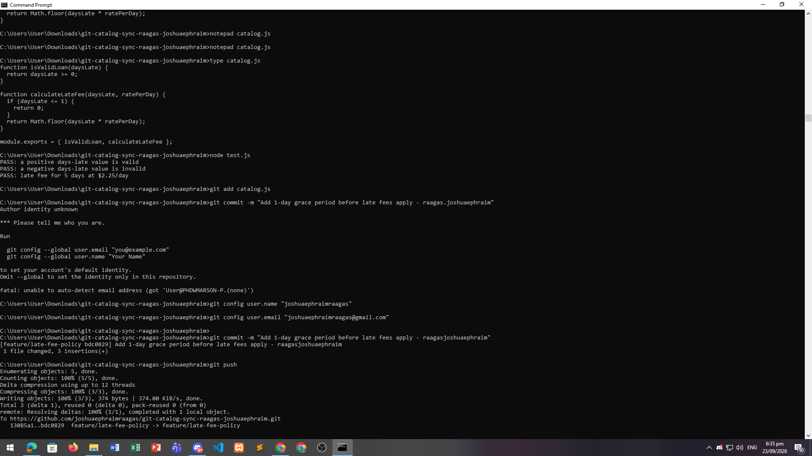
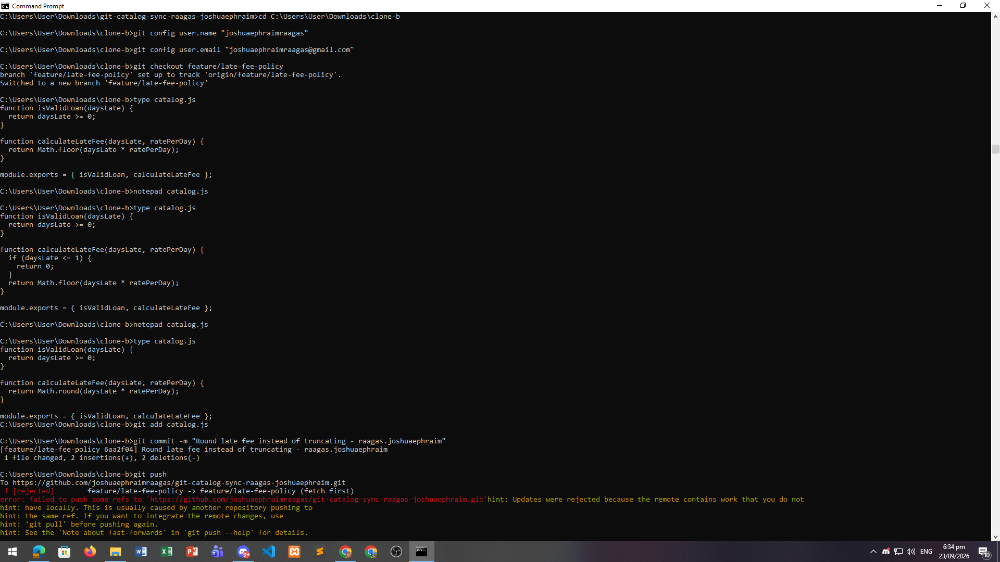
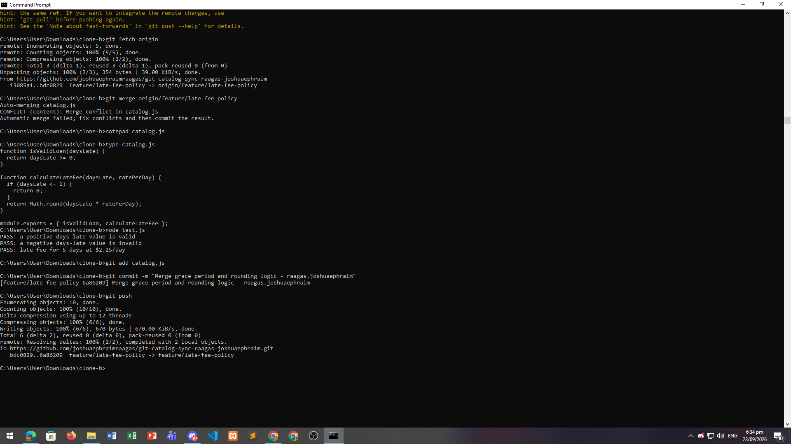
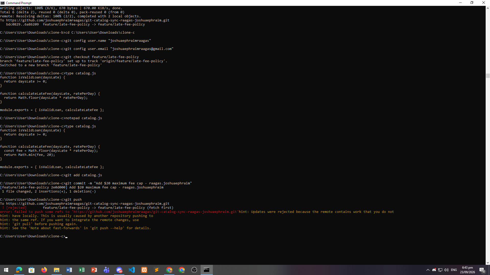
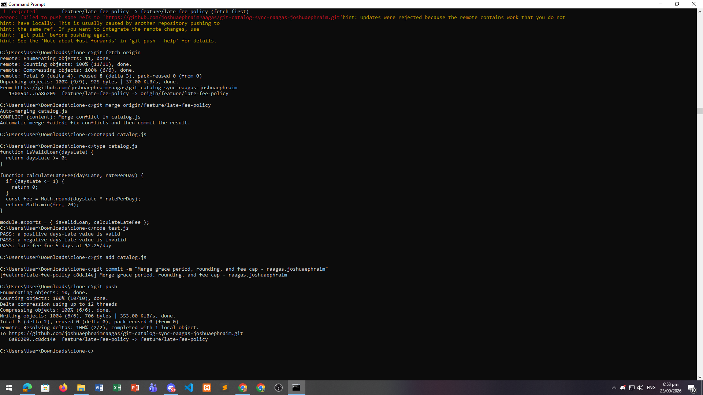
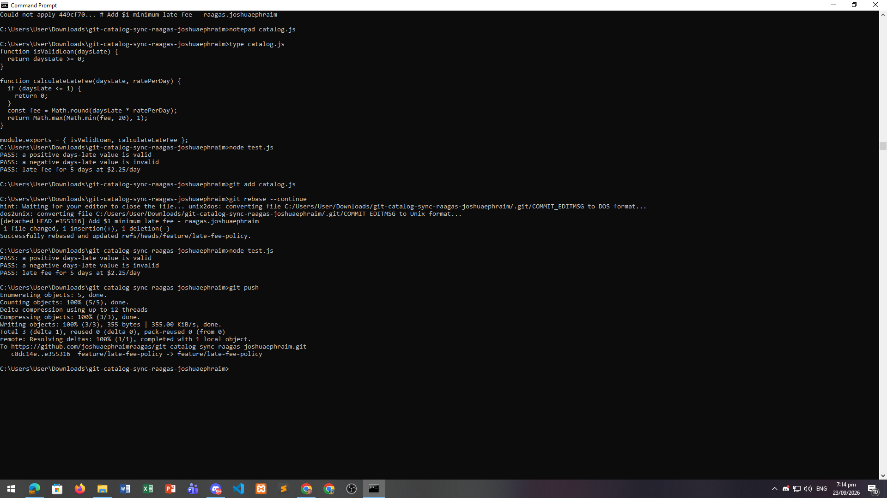
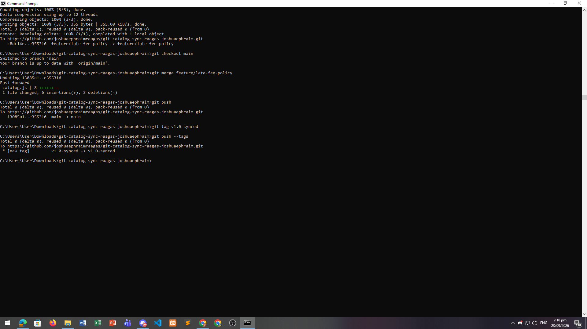

# WORKFLOW.md — Late Fee Policy Git Simulation

## Walk through the final calculateLateFee function and name which contributor's change is responsible for each part.

The final function has four parts. The grace period check at the top (if daysLate is 1 or less, return 0) came from Clone A's first push in Task 1. Clone B changed Math.floor to Math.round in Task 2, so the fee now rounds to the nearest whole number instead of truncating. Clone C added the $20 cap in Task 4 using Math.min, so the fee can never go over twenty dollars. The $1 minimum came from Clone A's rebase work in Task 6 using Math.max, so even a small fee never drops below one dollar.

## Compare Task 3's two-way conflict to Task 5's three-way conflict — what got harder with a third line of work?

Task 3 was a two-way conflict: only Clone A's grace period and Clone B's rounding were fighting over the same lines. I could look at both blocks and pick which lines to keep, then merge them by hand.

Task 5 was harder because by the time Clone C merged, three separate changes were sitting on the same spot in calculateLateFee. The remote side already had grace period and rounding merged together, so it wasn't a clean A-vs-B choice anymore — the incoming side was a compound of two earlier changes, and Clone C's $20 cap had to slot in on top of both. I had to think about the order the logic runs in (grace check first, then compute the fee, then apply the cap) instead of just picking lines. A third contributor multiplies the possible combinations, so the work shifts from "which block wins" to "what should this function actually do."

## What's the actual difference between how you resolved Task 5 (merge) and Task 6 (rebase)?

In Task 5 I used git merge, which created a new merge commit with two parents — one pointing at Clone C's branch and one at the remote branch. Both histories stayed visible in the log as a fork that joins back together. That resolution lives inside the merge commit, and pushing didn't need a force flag because nothing existing was rewritten.

In Task 6 I used git rebase, which took Clone A's commits and replayed them one at a time on top of the remote tip. Each replayed commit got a new hash, so the branch became a straight line with no merge commit. The conflict showed up per-commit instead of once at the end, so I resolved the same overlap more than once. This is also why a rebase usually needs a force push afterward — the old hashes are gone.

The short version: merge preserves history and adds a resolution commit, rebase rewrites history into a flat line. Merge is safer on branches other people share; rebase gives a cleaner log but is only safe on branches you own.

## If this were a real team of three, what one process change would have prevented all three rejected pushes?

Require everyone to fetch and pull the latest shared branch right before pushing — and push to their own feature branch instead of straight to the shared branch.

All three rejections (Task 2, Task 4, and the conflict hit during Task 6) happened because each clone was working from a stale view of the remote. Clone B and Clone C both committed locally without fetching first, so their histories had already diverged by the time they tried to push, and Git correctly refused the non-fast-forward update. If the team had a rule to pull right before pushing — or better, to push to a feature branch and open a PR — the divergence would show up as a reviewable diff instead of a rejection, and the conflicts would get resolved once with a clear record instead of surprising each contributor.

## TASKS

### Task-01

### Task-02

### Task-03

### Task-04

### Task-05

### Task-06

### Task-07

